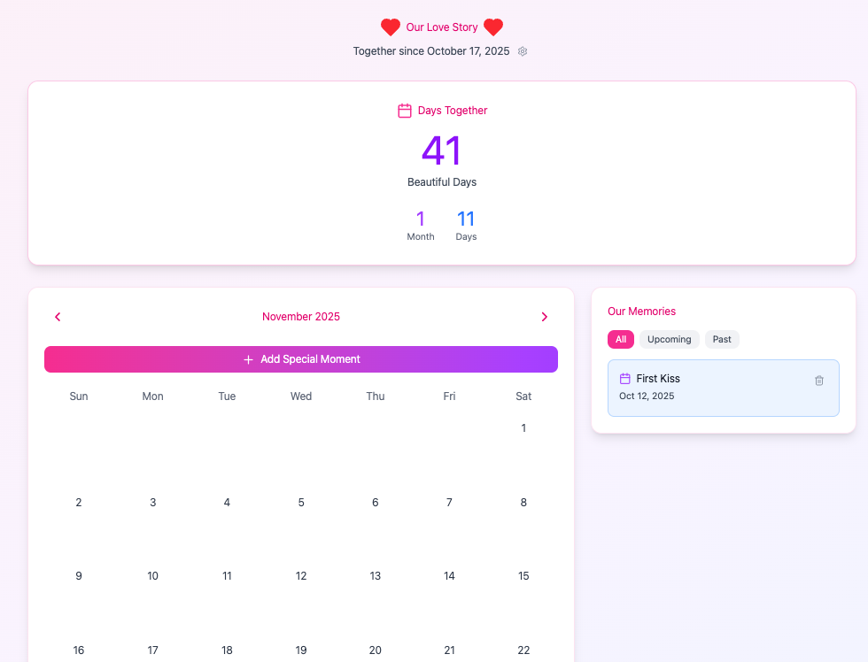

# 💕 Couples Calendar - Our Love Story

A real-time syncing calendar app for couples to track their special moments together.

<div align="center">
  
</div>

## 📁 Project Structure

```
calendar_love/
├── src/
│   ├── App.tsx                 # Main application component
│   ├── main.tsx                # Entry point
│   ├── firebase-config.ts      # Firebase configuration
│   ├── index.css               # Global styles
│   └── components/
│       ├── Calendar.tsx        # Calendar view component
│       ├── DayCounter.tsx      # Days together counter
│       ├── EventList.tsx       # Event list sidebar
│       ├── AddEventModal.tsx   # Add event modal
│       ├── ImageGallery.tsx    # Photo gallery viewer
│       └── SetupModal.tsx      # Initial setup modal
├── firebase.json               # Firebase hosting config
├── firestore.rules             # Database security rules
├── firestore.indexes.json      # Firestore indexes
├── vite.config.ts              # Vite build config
├── package.json                # Dependencies
└── env.example                 # Environment variables template
```
---

# 🚀 Quick Start - Download & Setup

> **Note:** Each user creates their own Firebase project and gets their own unique URL. Your data is completely private and separate from other users.

## Prerequisites

- [Node.js](https://nodejs.org/) (v18 or higher)
- [Git](https://git-scm.com/)
- A Google account (for Firebase)

---

## Step 1: Clone from GitHub (1 minute)

Open your terminal and run:

```bash
# Clone the repository
git clone https://github.com/yuancx2025/calendar_love.git

# Navigate into the project folder
cd calendar_love

# Install dependencies
npm install
```

✅ **Checkpoint:** You see "added X packages" in terminal

---

## Step 2: Install Firebase CLI (1 minute)

```bash
npm install -g firebase-tools
```

✅ **Checkpoint:** Running `firebase --version` shows a version number

---

## Step 3: Create Firebase Project (5 minutes)

### 3a. Go to Firebase Console
1. Open https://console.firebase.google.com/
2. Click **"Add project"**

### 3b. Create Project
1. **Name:** `couples-calendar` (or your choice)
2. Click **Continue**
3. **Google Analytics:** Toggle **OFF** (not needed)
4. Click **Create project**
5. Wait 30 seconds
6. Click **Continue**

### 3c. Enable Firestore
1. Left sidebar → **Build** → **Firestore Database**
2. Click **"Create database"**
3. Select **"Start in production mode"**
4. **Location:** Choose closest to you
   - US: `us-central`
   - Europe: `europe-west`
   - Asia: `asia-northeast`
5. Click **Enable**
6. Wait 30 seconds

### 3d. Register Web App
1. Click gear icon ⚙️ → **Project settings**
2. Scroll to **"Your apps"**
3. Click Web icon **</>**
4. **App nickname:** `Couples Calendar Web`
5. ✅ **Check** "Also set up Firebase Hosting"
6. Click **Register app**
7. **IMPORTANT:** You'll see config values - **DON'T CLOSE THIS PAGE YET!**

✅ **Checkpoint:** You see Firebase config values on screen

---

## Step 4: Set Up Environment Variables (2 minutes)

### 4a. Create .env File
In your project root, create a file named `.env` (dot env):

```bash
# Mac/Linux:
cp .env.example .env

# Windows:
copy .env.example .env
```

### 4b. Fill in Values
Open `.env` and paste your Firebase config values from Step 3d:

```env
VITE_FIREBASE_API_KEY=AIzaSyCxxxxxxxxxxxxxxxxxxxxxxxxx
VITE_FIREBASE_AUTH_DOMAIN=your-project.firebaseapp.com
VITE_FIREBASE_PROJECT_ID=your-project-id
VITE_FIREBASE_STORAGE_BUCKET=your-project.appspot.com
VITE_FIREBASE_MESSAGING_SENDER_ID=123456789012
VITE_FIREBASE_APP_ID=1:123456789012:web:xxxxxxxxxxxx
```

**Where to get these:**
- Still on the Firebase page from Step 3d?
- Or: Firebase Console → Settings ⚙️ → Project settings → Your apps → Config

✅ **Checkpoint:** `.env` file has all 6 values filled in

---

## Step 5: Test Locally (2 minutes)

```bash
npm run dev
```

1. Browser opens to http://localhost:3000
2. You see the "Welcome to Your Love Story" setup screen
3. **Enter your relationship start date**
4. Click "Begin Our Story"
5. **Add a test event**
6. **Verify it appears in the list**

✅ **Checkpoint:** App works locally, no console errors

**Check Console (F12):**
- No red errors
- Might see Firebase messages (that's normal)

---

## Step 6: Deploy to Firebase (5 minutes)

### 6a. Login
```bash
firebase login
```
- Browser opens
- Select your Google account
- Click **Allow**
- Close browser, return to terminal

### 6b. Initialize
```bash
firebase init
```

**Answer these questions:**

1. **Ready to proceed?** → **Y**

2. **Which features?** (Use spacebar to select):
   - [x] Firestore
   - [x] Hosting
   - Press Enter

3. **Use existing project?** → **Use an existing project**

4. **Select project:** → Choose your project from list

5. **Firestore rules file?** → Press Enter (accept default)

6. **Firestore indexes file?** → Press Enter (accept default)

7. **Public directory?** → Type: **dist** → Enter

8. **Single-page app?** → **Y**

9. **Automatic builds?** → **N**

10. **Overwrite index.html?** → **N**

### 6c. Build
```bash
npm run build
```

Wait for "Build successful" message

### 6d. Deploy
```bash
firebase deploy
```

Wait 1-2 minutes. You'll see:

```
✔ Deploy complete!

Hosting URL: https://your-project-id.web.app
```

✅ **Checkpoint:** Deployment successful, you have a URL!

---

## Step 7: Test Real-Time Sync (2 minutes)

### 7a. Open on Desktop
1. Open your Hosting URL in browser
2. Set up relationship start date
3. Add an event: "Test Event"

### 7b. Open on Phone
1. Open **same URL** on your phone
2. **Event appears automatically!** ✨

### 7c. Test Sync
1. **On phone:** Delete the "Test Event"
2. **On desktop:** Watch it disappear instantly! ⚡

✅ **Checkpoint:** Both devices show the same data in real-time!

---

## Step 8: Add to Home Screen (1 minute)

### iPhone/iPad
1. Safari → Share button
2. **"Add to Home Screen"**
3. Name: "Our Love Story"
4. Tap **Add**

### Android
1. Chrome → Three dots menu
2. **"Add to Home screen"**
3. Name: "Our Love Story"
4. Tap **Add**

✅ **Checkpoint:** App icon on home screen! 📱

---

## 🎉 You're Done!

### What You Have Now:
✅ App live at `https://your-project-id.web.app`
✅ Real-time sync between all devices
✅ Cloud backup (never lose data)
✅ Works on desktop, mobile, tablet
✅ Professional hosting
✅ Free forever

### Share With Your Partner:
Send them the URL! They can:
- Open in browser
- Add to home screen
- Start adding events
- Everything syncs instantly between you two!

---

## Daily Use

### Adding Events:
1. Open app on any device
2. Click date or "Add Special Moment"
3. Fill in details
4. Save
5. **Appears on all devices instantly!** ✨

### Updating the App:
```bash
# Make changes
npm run dev  # Test locally

# Deploy changes
npm run build
firebase deploy

# Live in 1 minute!
```

---

## Troubleshooting

### App doesn't load
- Check browser console (F12) for errors
- Verify `.env` values are correct
- Try incognito mode

### "Permission denied" error
```bash
firebase deploy --only firestore:rules
```

### Events not syncing
- Check internet connection
- Check Firebase Console → Firestore for data
- Verify both devices use same URL

### Need to redeploy
```bash
npm run build
firebase deploy
```

---

## Need Help?

1. Check **README.md** for detailed explanations
2. Check **DEPLOYMENT_GUIDE.md** for troubleshooting
3. Check browser console (F12) for error messages
4. Check Firebase Console for errors

---

## 🎊 Congratulations!

You successfully deployed a production-ready app with:
- Real-time database
- Cloud hosting
- Global CDN
- SSL encryption
- Professional infrastructure

**All for $0/month!**

Enjoy your couples calendar! 💕

---

## 📄 License

This project is open source and available under the MIT License.

---

## 💖 Made with Love

Built for couples who want to cherish every moment together. 💕
